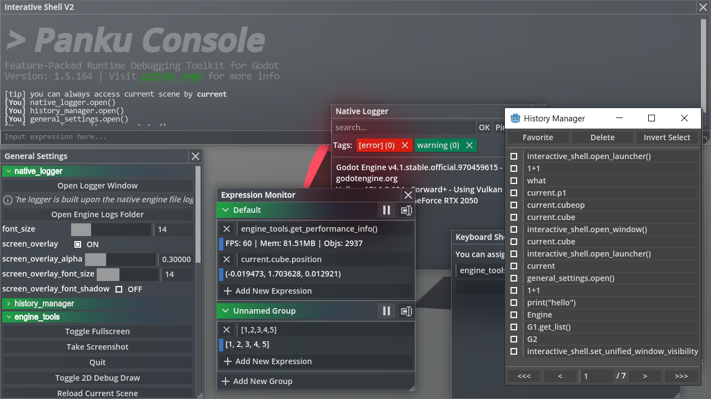
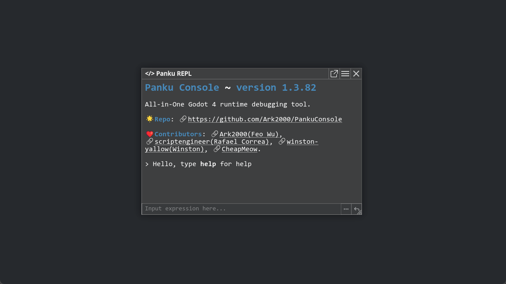
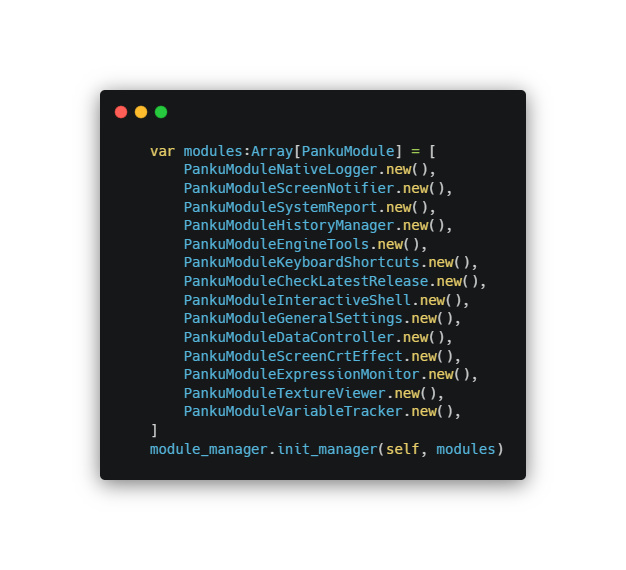

---

**Panku Console is a feature-packed real-time debugging toolkit for Godot Engine.** With Panku Console, you can easily interact with your scripts and objects at runtime, whether to cheat, debug, prototype, or just to have fun 😄🎮.

Panku Console is designed to be modular and extensible, and it is easy to add and maintain features. It is also designed to be as unobtrusive as possible, so you can use it in your project without worrying about the impact on the final product 🧩🚀.

# ✨ Highlights

## 📦 Tiny Footprint - Less than 256KB!

Panku Console is and will always be as lite as possible.

## 🖼️ Multi-window UI - Arrange your layout however you want!

Any windows can be scaled, snapped, collapsed, dragged and even become an [independent OS window](./docs/faq.md).



## 💻🔮 [Developer Console](./docs/developer_console.md) - Execute Arbitrary Code at runtime with hints!

Allows you to execute arbitrary [expressions](https://docs.godotengine.org/en/stable/tutorials/scripting/evaluating_expressions.html) (such as function calls) at runtime like if you were god 🧙‍♂️. 



## 📝🕹️ [Native Logger](./docs/native_logger.md) - Display native logs just in your game!

View native logs (the same as the editor output panel) in an overlay or a separate window 📋.


## 🛠️🔧 [Data Controller](./docs/data_controller.md) - Turn Any Object into a Tweakable Property Panel!

Automatically convert all export properties in your script into an inspector window.


## 👀🎮 [Expression Monitor](./docs/expression_monitor.md)

Watch the results of [expressions](https://docs.godotengine.org/en/stable/tutorials/scripting/evaluating_expressions.html) at runtime just in your game.


## And More... 🌟

- [History Manager](./docs/history_manager.md): view history inputs. ⏪
- [Keyboard Shortcut](./docs/keyboard_shortcut.md): bind expressions to keys for quick cheating. ⌨️🕹️
- [Screen Notifier](./docs/screen_notifier.md): display popup messages on the screen. 💬📢
- [Texture Viewer](./docs/texture_viewer.md): view textures in real time. 🖼️👁️
- [Misc Commands](./docs/misc_commands.md): provide some useful commands. 🛠️🔧
- [General Settings](./docs/general_settings.md): customize the console to your liking. ⚙️🔧
- [FAQ](./docs/faq.md): frequently asked questions. 🙋‍♂️🙋‍♀️

Since Panku Console is modular, you can easily remove or add features to suit your needs. 🧩🔧



# Installation 🚀

## A. Downloading GitHub `master` branch directly

1. Download [Latest commit](https://github.com/Ark2000/PankuConsole/archive/refs/heads/master.zip) from Github 📥.

2. Copy the `addons` folder to your project root directory 📂.

3. Enable this addon within the Godot settings ⚙️: `Project > Project Settings > Plugins`

## B. Using mirror repo as git submodule

Or if you prefer to use git(recommended), you can add this [mirror repo](https://github.com/Ark2000/panku_console) as a submodule in your addons folder which will automatically update the addon when you pull the latest changes 🔄.

```bash
# in your project root directory
cd addons
git submodule add https://github.com/Ark2000/panku_console
```

## C. Downloading from [Godot Asset Library](https://godotengine.org/asset-library/asset/1558)

Which is the same as downloading `godot4_asset_library` branch (always points to latest stable release version and only contains `addons` folder)

---

For more information about plugin installation, you can visit the corresponding [Godot documentation 📚](https://docs.godotengine.org/en/stable/tutorials/plugins/editor/installing_plugins.html).

> **Note**: Panku Console currently only supports Godot version 4.x, 3.x support is still in progress.

# Contribute 🤝

Do you want to contribute? Learn more in [the contribution section](./CONTRIBUTING.md). 🌟🙌

Also, see [Project Roadmap](https://github.com/Ark2000/PankuConsole/discussions/152) for more information about the development plan.

# License 📜

[MIT License](./LICENSE)

Copyright (c) 2022-present, Feo (k2kra) Wu
