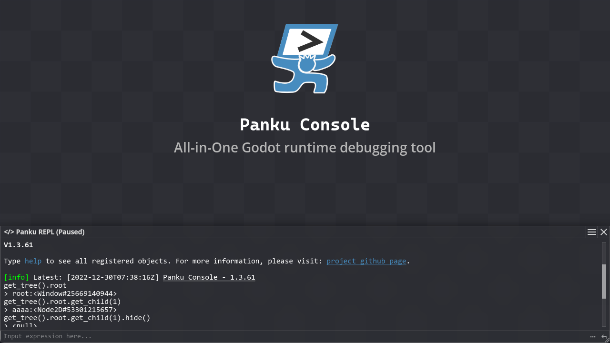
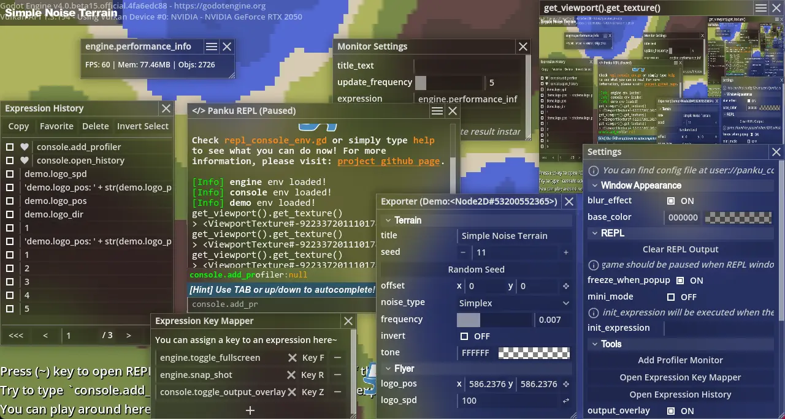
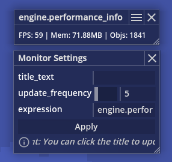
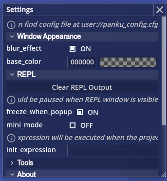
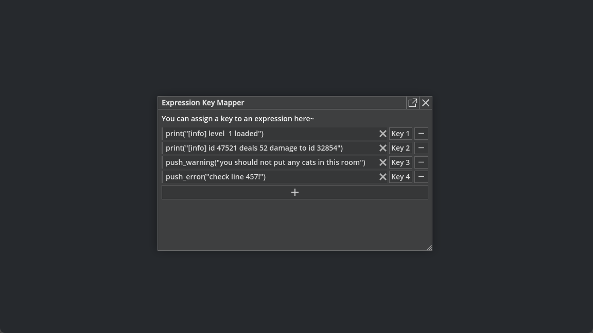
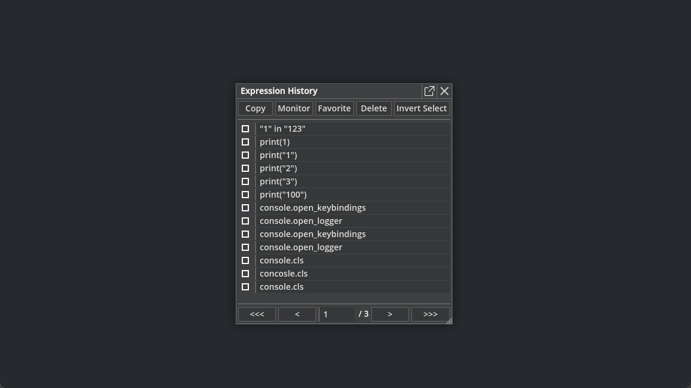
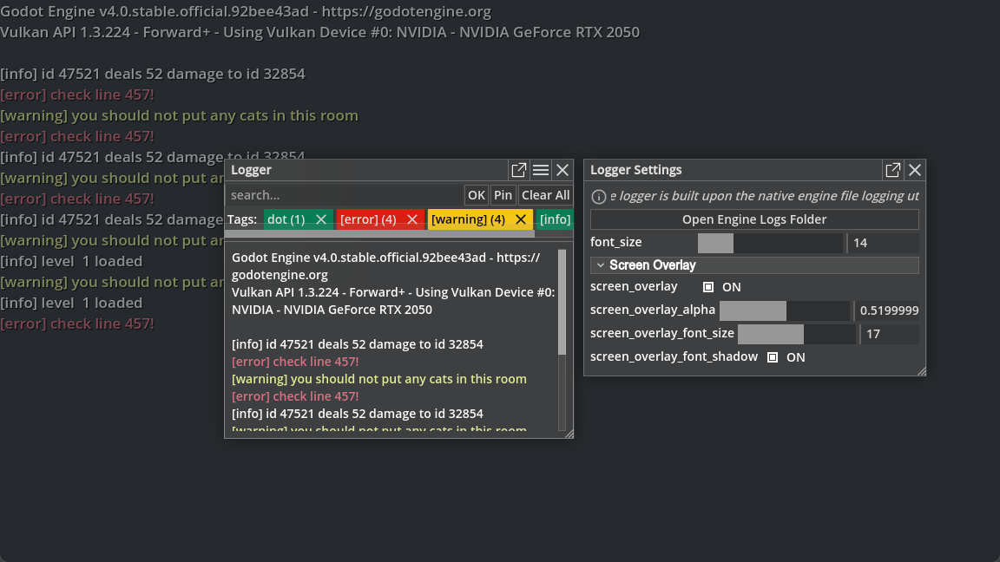

# **Panku Console**
 



All-in-One [Godot Engine 4](https://godotengine.org/) runtime debugging tool.

---

Language: **English** | [简体中文](README_cn.md)

# ✨ **Features**

In short, the core function of this plugin is to dynamically execute some simple expressions while the game is running. Of course, it is much more than that, in fact, this plugin is a collection of many practical tools. Here is a brief description of its features.

✅ **Flexible Multi-window System**. Any windows can be scaled, snapped, dragged and even become an independent os window.

✅ **Out-of-the-box Developer Console**. No need to define complex commands, enter any expression, execute it and get the result.

✅ **Expression Monitoring**. Create windows to see the results of expressions in real time.

✅ **Quick Key Binding**. Bind expressions to keys for quick cheating.

✅ **Popup Notification**. Pop up any message that deserves your attention.

✅ **Powerful Inspector Generator**. Automatically convert all export properties in your script into an inspector window.

✅ **History Management**. Manage all your input history, pin or merge history expressions.

✅ **Logger System**. Powered by the native file logging system, simple yet powerful.



# 🧪 **Installation**

1. Download [Latest commit](https://github.com/Ark2000/PankuConsole/archive/refs/heads/master.zip) or the stable [Release](https://github.com/Ark2000/PankuConsole/releases) version.

2. Copy the `addons` folder to your project root directory.

3. Enable `PankuConsole` in the Godot project addon settings.

For more information about plugin installation, you can visit the corresponding [Godot documentation](https://docs.godotengine.org/en/stable/tutorials/plugins/editor/installing_plugins.html).

> **Note**: This plugin only supports Godot version 4.x, and I personally do not plan to provide support for 3.x.

# 📚 **Quick Start**

This plugin is designed to take advantage of Godot's native features as much as possible, to provide as little API as possible, to reduce the intrusiveness of the project, to allow most of the operations to be done at runtime without causing additional burden for the developer, and to use pure GDScript development to maximize applicability and maintenance efficiency.

The plugin itself is designed only for developers, and if you want to include the plugin in your released game, you may need to make some modifications to avoid players directly accessing internal state.

## Expressions

In short, an expression is a set of constants, variables or function calls connected by mathematical operators, such as `console.notify("hello")`, `round(sin(2*PI+1.7*4.2+0.6))`, `null`. 

Also, expressions are implemented independently of GDScript and have nothing to do with the programming language you are currently using. If you want to know more, you can check the corresponding [Godot documentation](https://docs.godotengine.org/en/stable/tutorials/scripting/evaluating_expressions.html?highlight=expression).

> **Note**: Statements like `player.hp = 100` are not expressions. If you want to perform an assignment in an expression, you can use the `set` method of `Object`, for example `player.set("hp", 100)`, which is a legal expression.

## REPL Console


The REPL console is the entry point for all the functionality of this plugin. Once you have enabled this plugin, you can bring it up in almost any scenes by pressing the backquote key `~` (usually under ESC in the upper left corner of the keyboard), or of course you can customize it in the project settings or input map.

> **Note**: This plugin is currently only tested on PC, and has not been tested on mobile platforms.

In REPL console, you can.

1. Enter expressions and execute.

    The plugin provides a set of predefined objects and they are capable of such as switching full screen, setting game speed, etc. When there is no auto-completion, you can navigate history input by using up and down arrow keys. When there is auto-completion, press the TAB key to fill it automatically. The auto-completion is currently limited to a single property or function, which will probably be improved later.

2. Use the buttons on the right side of the input box to generate monitors from entered expression.

3. Click the button in the upper right corner to open settings.
   
    The settings window contains all tool shortcuts and most of the configurable items. The configuration file will be saved to the project user folder. 
    
    You can toggle the mini console mode in the settings window. In this mode, REPL console only retains the input box and auto-completion, which is more concise.

    

## Register Objects

Your script is not directly accessible in the expression's execution environment by default, you need to add it to the expression's execution environment manually.

The plugin automatically registers an Autoload singleton `Console` when it is enabled, and you can access the plugin's internals through this singleton. In general, to use this plugin, only one function `Console.register_env` is needed.

Suppose the following is a Player script.

```gdscript
extends Node2D

func _ready():
    # Add this object to the execution environment of the expression
    Console.register_env("player", self)

#Optional help message
const _HELP_hello = "sample function"
func hello(name):
    return "hello! %s" % name

#...
```

Now, you can type `player.hello("Jason")` in the REPL console to call the function defined in the above script directly.

Any methods or properties in the script that **do not begin with an underscore** will be added to the REPL console's auto-completion system (they will still be accessible, of course). Optionally, you can add description information to a method or property by defining a string constant named `_HELP_` + the corresponding method or property name.

Alternatively, the plugin's predefined registered objects can be viewed in the `default_repl_envs` folder in the plugin directory.

## Expression Monitor



With the expression monitor, you can watch the string result (or even textures) of an expression in real time.

You can customize the update frequency, window title, etc.

If you click on the title bar, the expression will be executed immediately. The update frequency of an expression monitor can be set to 0, so that it becomes a floating button.

When the project starts running, the plugin will automatically load the status information of all expression monitors from the last run that were save to the configuration file.

There are two ways to create expression monitors at runtime.

1. Create it by entering an expression directly in the REPL console and clicking the button to the right of the input box.

2. Create it via a predefined object, specifically `console.add_exp_monitor(...) `.

## Inspector Generator



Using inspector generator, you can generate corresponding inspector window directly from one of your registered objects.

The plugin provides a simple sample file of inspector generator, located in the `demo` folder, you can play around with it.

The value of variables can be modified in the inspector window, and also the inspector window will update value of variables in real time.

You can create it via a predefeined object, specifically `console.add_exporter(...) `.

Another point worth noting is that the settings window of REPL console is also generated entirely using this feature.

Currently supported types of exported variables are listed as follows.

```gdscript

#Export variables that start with an underscore will be ignored.
@export var _ignored := 0

#0. Grouping buttons
@export_group("Group 1")

#1. Rolling caption single line comment. Name needs to start with `export_comment_`.
@export var export_comment_1 = "This is a comment"

#2. button. The name should be in the format `export_button_xxx`, where `xxx` is the name of the function in the same file that will be called when the button is clicked.
@export var export_button_xxx = "Click Me"

#3. boolean variable.
@export var bool_val:bool = false

#4. color variable.
@export var color_val:Color = Color.WHITE

#5. string variable.
@export var string_val:String = ""

#6. simple int variables.
@export var int_val:int = 0

#7. simple float variable.
@export var float_val:float = 0

#8. numeric (int or float) variables with ranges.
@export_range(0.0, 1.0, 0.01) var ranged_number := 0.0

#9. vector2 variable.
@export var vec2_val:Vector2 = Vector2.ZERO

#10. enumerate integer values
@export_enum("option 1", "option 2", "option 3") var enum_val := 0

#11. Unsupported variables will be displayed as read-only strings.
@export var node_val:Node

#12. You can control the access behavior with the setget function.
@export var dummy_val:int:
    set(val): pass
    get: return 0

#Button callback functions
func xxx():
    print("xxx is called")

```

## Quick Key Binding



By using this feature, you can bind the execution of an expression to a key, for example, to take a quick screenshot, switch to full screen, etc. Key combinations are not supported at the moment.

They are two ways to open key binding window:

1. Click the `Open Expression Key Mapper` button in REPL Console settings window.
2. Execute `console.open_keybindings` in REPL console to open it.

The keybindings information will be saved to the configuration file.

## History Manager



Use this feature to view and manage the input history of the REPL Console, you can pin frequently used expressions, merge the string results of multiple expressions, etc.

They are two ways to history manager window:

1. Click the `Open Expression History` button in REPL Console settings window.
2. Execute `console.open_history` in REPL console to open it.

The history input information will be saved to the configuration file.

## Logger



- With our logger, there's no need to modify any code. It's built upon Godot's native file logging system ,which means it automatically monitors Godot's native log functions like `print`, `printt`, `push_warning` and `push_error`.
- To help you easily filter through logs, you can use tags.
- If you need to keep an eye on the logger output in real-time you can overlay it on your screen.

# **Contributors**

Thanks to these nice [people who contributed to this project](https://github.com/Ark2000/PankuConsole/graphs/contributors), you can also participate in ways including but not limited to:

1. if you find bugs or have any suggestions, you can submit [Issues](https://github.com/Ark2000/PankuConsole/issues)

2. if you have questions, you can discuss them in the [Discussion](https://github.com/Ark2000/PankuConsole/discussions)

3. You can also [Contribute Code](https://github.com/Ark2000/PankuConsole/pulls) directly to this project, please refer to [Recent Commits](https://github.com/Ark2000/PankuConsole/commits/master) for the specification of commit message or [here](https://www.conventionalcommits.org/en/v1.0.0/#summary)

# **License**

[MIT License](LICENSE)

Copyright (c) 2022-present, Feo (k2kra) Wu