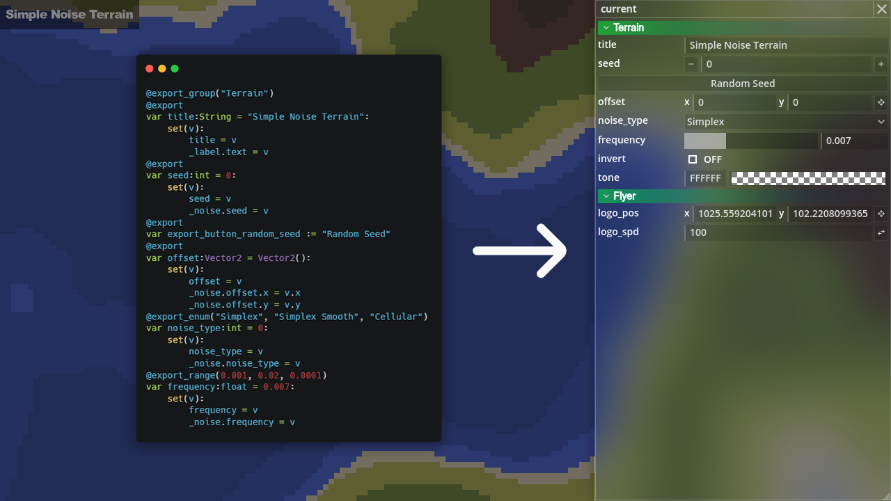

# Data Controller



You can generate data controller window directly from available objects. The value of variables can be modified in the data controller window, and also the data controller window will update value of variables in real time, it is a bidirectional data binding.

You can create one by simply typing the object expression in [developer console](./developer_console.md). For example, if you typed `current` in developer console and the scene root script contains export variables, a data controller will be automatically created according to the export variables.

> A fact worth noting is that the [general settings](./general_settings.md) window(created by `general_settings.open()`) is also generated by data controller.

## Supported Types

Currently supported types of exported variables are listed as follows.

```gdscript

#Export variables that start with an underscore will be ignored.
@export var _ignored := 0

#0. Grouping buttons
@export_group("Group 1")

#1. Rolling caption single line comment. Name needs to start with `export_comment_`.
@export var export_comment_1 = "This is a comment"

#2. button. The name should be in the format `export_button_xxx`, where `xxx` is the name of the function in the same file that will be called when the button is clicked.
@export var export_button_xxx = "Click Me"

#3. boolean variable.
@export var bool_val:bool = false

#4. color variable.
@export var color_val:Color = Color.WHITE

#5. string variable.
@export var string_val:String = ""

#6. simple int variables.
@export var int_val:int = 0

#7. simple float variable.
@export var float_val:float = 0

#8. numeric (int or float) variables with ranges.
@export_range(0.0, 1.0, 0.01) var ranged_number := 0.0

#9. vector2 variable.
@export var vec2_val:Vector2 = Vector2.ZERO

#10. enumerate integer values
@export_enum("option 1", "option 2", "option 3") var enum_val := 0

#11. Unsupported variables will be displayed as read-only strings.
@export var node_val:Node

#12. You can control the access behavior with the setget function.
@export var dummy_val:int:
    set(val): pass
    get: return 0

#Button callback functions
func xxx():
    print("xxx is called")

```

## Related Files

`panku_console/modules/data_controller/*`
