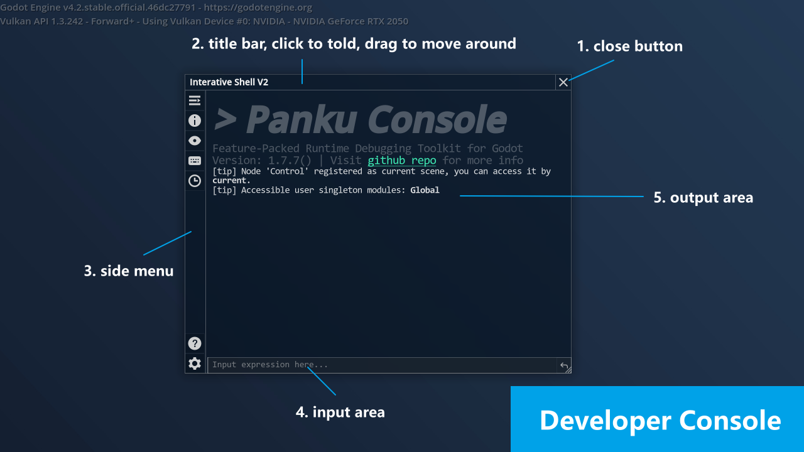
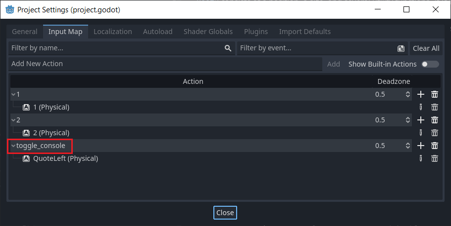
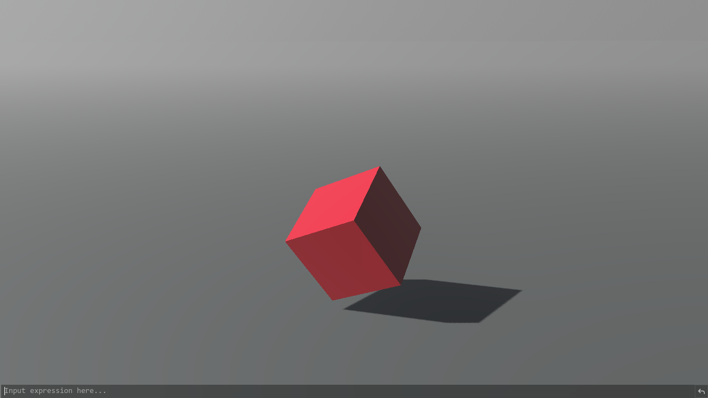

# Developer Console



The developer console is a tool that allows you to execute arbitrary GD expressions at runtime. You can bring it up by pressing the `~` key in the game by default. It is very useful for debugging and testing.

The plugin provides a set of predefined objects and they are capable of such as switching full screen, setting game speed, etc. When there is no auto-completion, you can navigate history input by using up and down arrow keys. When there is auto-completion, press the TAB key to fill it automatically. 

> **Note**: This plugin is currently only tested on PC, and has not been tested on mobile platforms.

## What Are Expressions?

In short, an expression is a set of constants, variables or function calls connected by mathematical operators, such as `interactive_shell.open_window()`, `round(sin(2*PI+1.7*4.2+0.6))`, `null`. 

Expressions are implemented independently of GDScript and have nothing to do with the programming language you are currently using. If you want to know more, you can check the corresponding [Godot documentation](https://docs.godotengine.org/en/stable/tutorials/scripting/evaluating_expressions.html?highlight=expression).

> **Note**: Statements like `player.hp = 100` are not expressions. If you want to perform an assignment in an expression, you can use the `set` method of `Object`, for example `player.set("hp", 100)`, which is a legal expression.

## Access Your Objects

By default, the execution environment contains all modules' environment variable, all methods under `@GlobalScope`(such as `print`, `round`, etc.), and some basic class constructors(such as `Vector2()`, `Array()`).

Your **current scene root** (the last child of `get_tree().root`) will be automatically registered and updated as `current` in the expression execution environment. This means that you can access anything in your scene root script directly, which is very convenient.For example, if you have a `player` variable in your scene root script, you can access it directly in the expression by typing `current.player` or `current.player.hp`.

All of your **autoload singletons** will be automatically registered at the beginning in the expression execution environment. For example, if you have an `AudioManager` singleton, you can access it directly in the expression by typing `AudioManager`.

You can also **register your own objects** in the expression execution environment. For example, if you have a `Player` class, you can register it by calling `Panku.gd_exprenv.register_env("player", Player.new())`, and then you can access it directly in the expression by typing `player`. But it's **not recommended** to do this, since it will introduce unnecessary dependencies.

## About Hinting

Any methods or properties in user script that **do not begin with an underscore** will be added to the auto-completion system. Optionally, you can add description information to a method or property by defining a string constant named `_HELP_xxx`, `xxx` stands for the corresponding method or property name. 

For example:

```gdscript
const _HELP_simple_func = "This is a simple function."
func simple_func():
    print("simple func")
```

The auto-completion is currently limited to a single property or function, which may be improved later.

## Change Key Binding

By default, the developer console is bound to the `~` key. You can change it in the **input map settings**.

Just add a new action named `toggle_console` and bind it to the input events you want like this:



## Related Commands

- `interactive_shell.open_window()`

    Open the developer console window.

- `interactive_shell.open_launcher()`

    Open the developer console minimized version, which only contains the input box and auto-completion.

    

- `interactive_shell.set_unified_window_visibility(enabled:bool)`

    Set whether all windows' visibility should keep the same as the developer console window.

- `interactive_shell.set_pause_if_popup(enabled:bool)`

    Set whether the game should pause when the developer console window is opened.

You can tweak more settings in [general settings](./general_settings.md).

## Related Files

`panku_console/modules/interactive_shell/*`

`panku_console/modules/variable_tracker/*`
