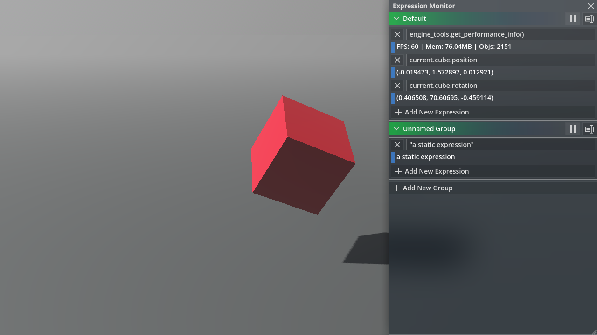

# Expression Monitor

With this tool, you can monitor any expression's value in real time. Expressions are grouped to make it easier to manage. You can start/stop, rename and reorder groups.

## Related Commands

- `expression_monitor.open_window()`

    Open the expression monitor window.

## Related Files

`panku_console/modules/expression_monitor/*`
