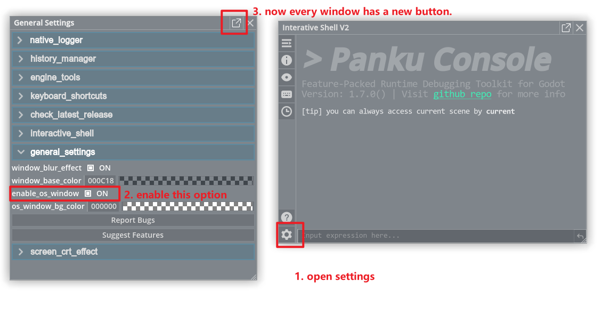
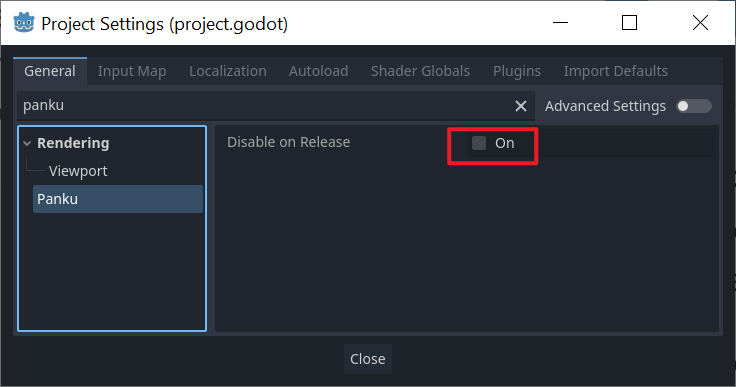
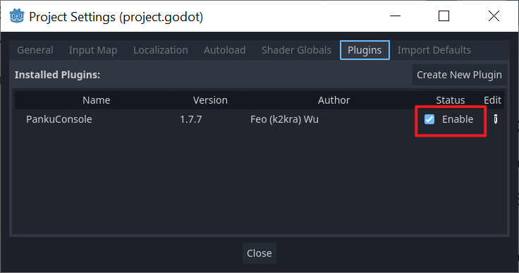

# How to pop out OS window?

1. Open the developer console.

2. Click the settings button on the bottom left corner to open the settings window.

3. Go to the `general_settings` tab.

4. Check the `enable_os_window` option.

5. Now, `pop` buttons will be displayed on the top right corner of each window.

More about this feature, please refer to [Issue #23](https://github.com/Ark2000/PankuConsole/issues/23)

# How to disable plugin on exporting release build?

Go to project settings in editor, and then go to `General` tab, check the `Disable On Release` option.

If you can't find this option, reactivation may be required.

