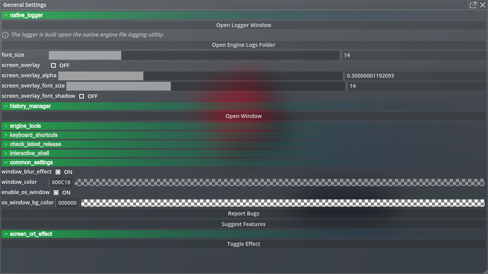

# General Settings

By clicking the settings button on the bottom left corner of developer console, you can open the settings window.

Each module provides its own settings by `opt.gd` and General Settings module will automatically collect all the settings and aggregate them into one settings unified window.

Since General Settings itself is also a module, it as well provides its own settings as `common_settings`.

## Related Commands

- `general_settings.open()`

    Open general settings window.

## Related Files

`panku_console/modules/general_settings/*`
