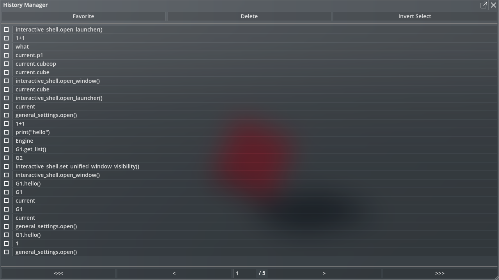

# History Manager

Use this tool to view and manage the input history of the developer console, you can pin frequently used expressions and edit which.

## Related Commands

- `history_manager.open()`

    Open the history manager window.

## Related Files

`panku_console/modules/history_manager/*`