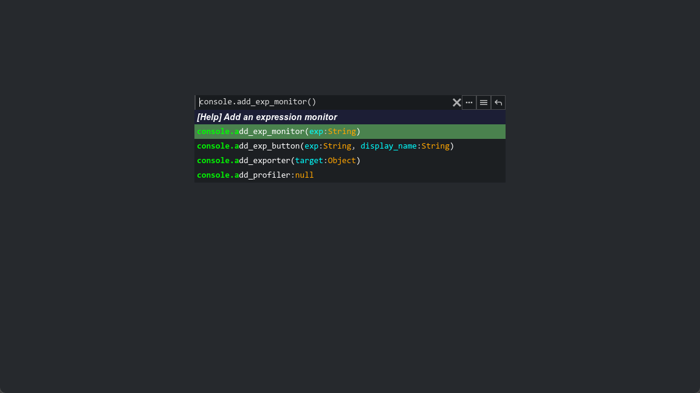

# Interactive Shell


The interactive shell is the entry point for all the functionality of this plugin. Once you have enabled this plugin, you can bring it up in almost any scenes by pressing the backquote key `~` (usually under ESC in the upper left corner of the keyboard), or of course you can customize it in the project settings or input map.

> **Note**: This plugin is currently only tested on PC, and has not been tested on mobile platforms.

In interactive shell, you can.

1. Enter expressions and execute.

    The plugin provides a set of predefined objects and they are capable of such as switching full screen, setting game speed, etc. When there is no auto-completion, you can navigate history input by using up and down arrow keys. When there is auto-completion, press the TAB key to fill it automatically. The auto-completion is currently limited to a single property or function, which will probably be improved later.

2. Use the buttons on the right side of the input box to generate monitors from entered expression.

3. Click the button in the upper right corner to open settings.
   
    The settings window contains all tool shortcuts and most of the configurable items. The configuration file will be saved to the project user folder. 
    
    You can toggle the mini console mode in the settings window. In this mode, REPL console only retains the input box and auto-completion, which is more concise.

    

## Expressions

In short, an expression is a set of constants, variables or function calls connected by mathematical operators, such as `console.notify("hello")`, `round(sin(2*PI+1.7*4.2+0.6))`, `null`. 

Also, expressions are implemented independently of GDScript and have nothing to do with the programming language you are currently using. If you want to know more, you can check the corresponding [Godot documentation](https://docs.godotengine.org/en/stable/tutorials/scripting/evaluating_expressions.html?highlight=expression).

> **Note**: Statements like `player.hp = 100` are not expressions. If you want to perform an assignment in an expression, you can use the `set` method of `Object`, for example `player.set("hp", 100)`, which is a legal expression.

## Register Objects

Your script is not directly accessible in the expression's execution environment by default, you need to add it to the expression's execution environment manually.

The plugin automatically registers an Autoload singleton `Console` when it is enabled, and you can access the plugin's internals through this singleton. In general, to use this plugin, only one function `Console.register_env` is needed.

Suppose the following is a Player script.

GDScript:

```gdscript
extends Node2D

func _ready():
    # Add this object to the execution environment of the expression
    Console.register_env("player", self)

#Optional help message
const _HELP_hello = "sample function"
func hello(name):
    return "hello! %s" % name

#...
```

C#:

```csharp
using Godot;

public partial class MyPlayer : Node
{
	static string _HELP_hello = "sample function";
	public void hello(string name)
	{
		GD.Print("hello! ", name);
	}

	public override void _Ready()
	{
        // Use `GetNode` to access PankuConsole singleton.
		GetNode<Node>("/root/Console").Call("register_env", "player", this);
	}
}
```

Now, you can type `player.hello("Jason")` in the REPL console to call the function defined in the above script directly.

Any methods or properties in the script that **do not begin with an underscore** will be added to the REPL console's auto-completion system (they will still be accessible, of course). Optionally, you can add description information to a method or property by defining a string constant named `_HELP_` + the corresponding method or property name.

Alternatively, the plugin's predefined registered objects can be viewed in the `default_repl_envs` folder in the plugin directory.