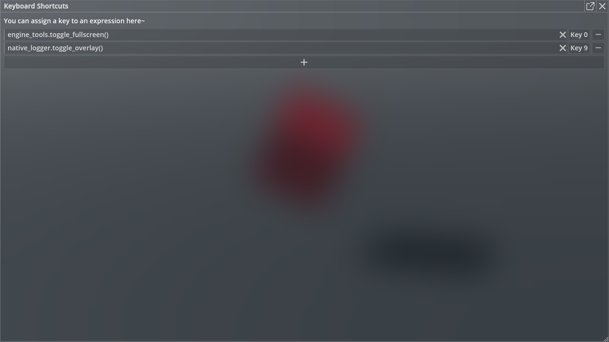

# Keyboard Shortcut

By using this feature, you can bind the execution of an expression to a key, for example, to take a quick screenshot, switch to full screen, etc. Key combinations are not supported at the moment.

## Related Commands

- `keyboard_shortcuts.open()`

    Open the keyboard shortcut window.

## Related Files

`panku_console/modules/keyboard_shortcuts/*`