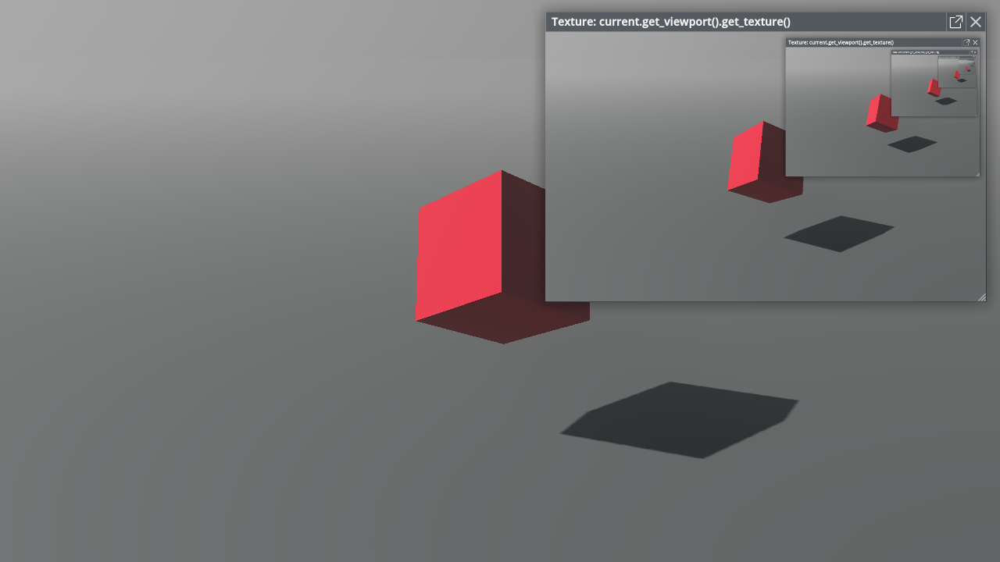

# Texture Viewer

Texture viewer can be used to view any textures at runtime.

You can create one by simply typing the object expression in **developer console**. For example, if you typed `current.get_viewport().get_texture()`, since the return value is a texture, a texture viewer will be automatically created and updated.

## Related Files

`panku_console/modules/texture_viewer/*`